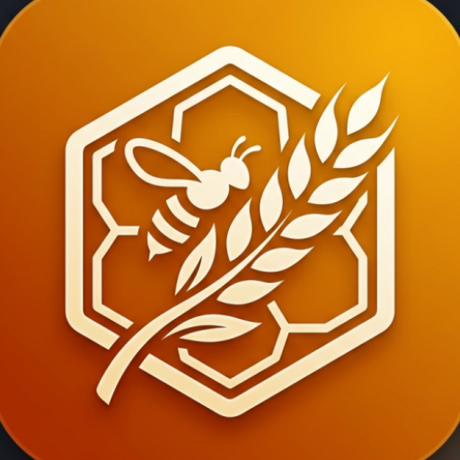

# 🌿 Madhu-Siri — Smart Agriculture & Apiculture Platform

<p align="center">
  
</p>

<p align="center">
  <b>Bridging Farmers & Beekeepers with Real-Time Intelligence</b><br/>
  A production-ready Android application built for rural India's green ecosystem.
</p>

<p align="center">
  
  
  
  
  
  
</p>

---

## 📖 Overview

**Madhu-Siri** is a smart, dual-role Android platform that connects **Farmers** and **Beekeepers** in real time. When a farmer plans to spray pesticides on their fields, Madhu-Siri automatically alerts nearby beekeepers — protecting bee colonies that are critical to pollination and honey production. The app leverages GPS, Firebase Realtime Database, and push notifications to ensure timely, life-saving communication in rural agricultural communities.

> **"Madhu"** means *honey* in Kannada/Sanskrit — symbolizing the beekeeper community.  
> **"Siri"** means *prosperity* — representing the thriving farmer community.

---

## ✨ Key Features

### 👨‍🌾 For Farmers
- **Role-Based Onboarding** — Register as a Farmer with a seamless, guided setup flow
- **Farm Location Pinning** — Long-press on Google Maps to pin precise farm coordinates
- **Spraying Alert System** — Trigger one-tap alerts that notify all beekeepers within a **2 km radius**
- **Farmer Dashboard** — Rich overview with weather-integrated farm analytics
- **AI Crop Assistant** — Chat-based assistant for crop health advice and recommendations
- **Offline Diary** — Log daily farm activities, backed by Room local database

### 🐝 For Beekeepers
- **Real-Time Proximity Alerts** — Instantly receive push notifications when a farmer nearby is spraying
- **Hive Location Management** — Pin and manage multiple hive locations on an interactive map
- **Hive Health Log** — Track health history per hive (with timestamps and notes)
- **Beekeeper Dashboard** — Overview of registered hives, recent alerts, and health summaries
- **Long-Press Map Interaction** — Precisely pin hive locations with a single gesture

### 🔔 Alert System
- **Haversine Formula** — Mathematically precise 2 km radius detection between farmer & beekeeper GPS coordinates
- **Foreground Location Service** — Background GPS monitoring with battery-optimized 5-minute update intervals
- **Firebase Cloud Messaging (FCM)** — Instant push delivery for spraying alerts
- **High-Priority Notifications** — Delivered even in Doze mode

### 🤖 AI Assistant
- **Rule-Based Chat Interface** — In-app Siri-style assistant for agricultural and apiculture queries
- **Contextual Q&A** — Covers topics like crop calendars, pesticide safety, pollination windows
- **Dual-Persona** — Adapts suggestions based on whether the user is a Farmer or Beekeeper

---

## 🏗️ Architecture

Madhu-Siri follows **Clean Architecture** principles with a strict separation of concerns:

```
app/
└── src/main/java/com/madhusiri/app/
    ├── core/                    # App-wide utilities & constants
    ├── data/
    │   ├── local/               # Room Database entities, DAOs
    │   └── repository/          # Repository implementations
    ├── di/                      # Hilt Dependency Injection modules
    │   ├── DataModule.kt        # Provides Room DB, Firebase instances
    │   └── RepositoryModule.kt  # Binds repository interfaces
    ├── domain/
    │   └── repository/          # Repository interfaces (contracts)
    ├── services/
    │   ├── AlertService.kt      # Foreground service: GPS + Haversine + alerts
    │   ├── MyFirebaseMessagingService.kt  # FCM push notification handler
    │   └── SyncWorker.kt        # WorkManager background sync task
    └── ui/
        ├── OnboardingActivity.kt        # Role selection & registration
        ├── MainActivity.kt              # Host Activity with NavController
        ├── farmer/
        │   └── FarmerDashboardFragment.kt
        ├── beekeeper/
        │   └── BeekeeperDashboardFragment.kt
        ├── map/
        │   └── MapFragment.kt           # Interactive Google Maps + hive pinning
        ├── assistant/
        │   ├── AssistantFragment.kt     # AI chat interface
        │   ├── ChatAdapter.kt           # RecyclerView adapter for chat bubbles
        │   └── ChatMessage.kt           # Chat data model
        ├── DiaryFragment.kt             # Offline farm diary
        ├── DiaryViewModel.kt
        ├── DashboardFragment.kt
        └── DashboardViewModel.kt
```

### Design Patterns Used
| Pattern | Usage |
|---|---|
| **MVVM** | All UI fragments backed by ViewModels |
| **Repository Pattern** | Abstracts Firebase + Room data sources |
| **Dependency Injection (Hilt)** | App-wide DI for testability & scalability |
| **Observer Pattern** | LiveData / StateFlow for reactive UI updates |
| **Foreground Service** | Persistent GPS location monitoring |
| **WorkManager** | Reliable background sync tasks |

---

## 🛠️ Tech Stack

| Category | Technology | Version |
|---|---|---|
| **Language** | Kotlin | 1.9.22 |
| **Build System** | Gradle (KTS) + AGP | 8.13.2 |
| **UI** | Material Design 3 | 1.11.0 |
| **Architecture** | MVVM + Clean Architecture | — |
| **DI** | Hilt | 2.48 |
| **Navigation** | Jetpack Navigation Component | 2.7.7 |
| **Database (Local)** | Room | 2.6.1 |
| **Database (Remote)** | Firebase Realtime Database | BOM 32.7.2 |
| **Push Notifications** | Firebase Cloud Messaging (FCM) | BOM 32.7.2 |
| **Crash Reporting** | Firebase Crashlytics | BOM 32.7.2 |
| **Analytics** | Firebase Analytics | BOM 32.7.2 |
| **Maps** | Google Maps SDK | 18.2.0 |
| **Location** | Google Play Services Location | 21.1.0 |
| **Background Tasks** | WorkManager | 2.9.0 |
| **View Binding** | Android ViewBinding | Built-in |
| **Annotation Processing** | KSP | 1.9.22-1.0.17 |
| **Code Shrinking** | R8 / ProGuard | Enabled (Release) |

---

## 🔐 Firebase Security Rules

The app uses strict, **role-based** Firebase Realtime Database security rules:

```json
{
  "rules": {
    ".read": "auth != null",
    ".write": "auth != null",
    "alerts": {
      "$alertId": {
        ".validate": "newData.hasChildren(['farmerId', 'lat', 'lng', 'timestamp'])"
      }
    },
    "hives": {
      "$userId": {
        ".read": "$userId === auth.uid",
        ".write": "$userId === auth.uid",
        "$hiveId": {
          ".validate": "newData.hasChildren(['lat', 'lng', 'ownerId'])"
        }
      }
    },
    "health_logs": {
      "$userId": {
        ".read": "$userId === auth.uid",
        ".write": "$userId === auth.uid"
      }
    }
  }
}
```

- ✅ All reads/writes require authentication  
- ✅ Hive and health log data is scoped to the owning user's UID  
- ✅ Schema validation enforces required fields on all writes  

---

## 📱 Screens & Navigation

```
OnboardingActivity
    └── Role Selection (Farmer / Beekeeper)
        └── Profile Setup

MainActivity (NavController)
    ├── Dashboard (role-specific)
    │   ├── FarmerDashboardFragment    ← Farm stats, spraying trigger
    │   └── BeekeeperDashboardFragment ← Hive list, alert history
    ├── MapFragment                    ← Google Maps, location pinning
    ├── DiaryFragment                  ← Offline activity log
    └── AssistantFragment              ← AI chat assistant
```

---

## ⚙️ Setup & Installation

### Prerequisites
- Android Studio **Hedgehog** or newer
- JDK 17
- Google account with Firebase & Google Cloud access
- A physical device or emulator (API 24+)

### Step 1: Clone the Repository
```bash
git clone https://github.com/Sujith2391/Madhu-Siri.git
cd Madhu-Siri
```

### Step 2: Firebase Setup
1. Go to [Firebase Console](https://console.firebase.google.com/) and create a new project
2. Register your Android app with package name: `com.madhusiri.app`
3. Download `google-services.json` and place it at `app/google-services.json`
4. Enable the following Firebase services:
   - **Realtime Database** (set region, apply the rules from `firebase-rules.json`)
   - **Cloud Messaging (FCM)**
   - **Crashlytics**
   - **Analytics**

### Step 3: Google Maps API Key
1. Visit [Google Cloud Console](https://console.cloud.google.com/)
2. Enable **Maps SDK for Android** and **Geocoding API**
3. Create an API Key and restrict it to your app's SHA-1 fingerprint
4. Add it to `AndroidManifest.xml` (already referenced as metadata):
   ```xml
   <meta-data
       android:name="com.google.android.geo.API_KEY"
       android:value="YOUR_API_KEY_HERE" />
   ```

### Step 4: Build & Run
```bash
# Debug build
./gradlew assembleDebug

# Install on connected device
./gradlew installDebug
```

### Step 5: Release Build (Optional)
A keystore is included as `madhu-siri.jks` for signing release builds:
```bash
./gradlew assembleRelease
```
R8 minification and resource shrinking are enabled by default in release builds.

---

## 📦 Permissions

| Permission | Reason |
|---|---|
| `INTERNET` | Firebase & API communication |
| `ACCESS_FINE_LOCATION` | Precise GPS for proximity detection |
| `ACCESS_COARSE_LOCATION` | Fallback location approximation |
| `POST_NOTIFICATIONS` | Spraying alerts (Android 13+) |
| `FOREGROUND_SERVICE` | Persistent location monitoring |
| `FOREGROUND_SERVICE_LOCATION` | Location type declaration for foreground service |

---

## 🧩 Core Logic: Haversine Alert System

The heart of the app is the **`AlertService`** — a `ForegroundService` that:
1. Polls the user's GPS location every **5 minutes** (battery-optimized)
2. Queries all registered beekeeper locations from Firebase
3. Calculates the great-circle distance using the **Haversine formula**
4. Fires a **high-priority push notification** if any beekeeper is within **2 km**

```kotlin
private fun calculateHaversineDistance(lat1: Double, lon1: Double, lat2: Double, lon2: Double): Double {
    val r = 6371.0  // Earth's radius in km
    val dLat = Math.toRadians(lat2 - lat1)
    val dLon = Math.toRadians(lon2 - lon1)
    val a = sin(dLat / 2).pow(2) +
            cos(Math.toRadians(lat1)) * cos(Math.toRadians(lat2)) *
            sin(dLon / 2).pow(2)
    return r * 2 * atan2(sqrt(a), sqrt(1 - a))
}
```

---

## 🗺️ Roadmap

- [x] Role-based onboarding (Farmer / Beekeeper)
- [x] Google Maps integration with long-press pinning
- [x] Firebase Realtime Database with secure rules
- [x] Haversine-based 2km proximity alert system
- [x] Firebase Cloud Messaging (FCM) push notifications
- [x] Offline diary with Room database
- [x] AI assistant (rule-based chat)
- [x] Hive health logging
- [x] R8/ProGuard release build optimization
- [x] Firebase Crashlytics & Analytics integration
- [ ] Firebase Authentication (Email / Phone OTP)
- [ ] Weather API integration (OpenWeatherMap)
- [ ] Multilingual support (Kannada, Hindi, Telugu)
- [ ] Crop disease image detection (ML Kit)
- [ ] Market price feed for crops & honey
- [ ] Admin dashboard (web portal)

---

## 🤝 Contributing

We welcome contributions! Here's how to get started:

1. **Fork** the repository
2. **Create** a feature branch: `git checkout -b feature/your-feature-name`
3. **Commit** your changes: `git commit -m 'feat: add your feature'`
4. **Push** to your branch: `git push origin feature/your-feature-name`
5. **Open** a Pull Request

Please follow the [Conventional Commits](https://www.conventionalcommits.org/) specification.

---

## 📄 License

```
MIT License

Copyright (c) 2026 Madhu-Siri Team

Permission is hereby granted, free of charge, to any person obtaining a copy
of this software and associated documentation files (the "Software"), to deal
in the Software without restriction, including without limitation the rights
to use, copy, modify, merge, publish, distribute, sublicense, and/or sell
copies of the Software, and to permit persons to whom the Software is
furnished to do so, subject to the following conditions:

The above copyright notice and this permission notice shall be included in all
copies or substantial portions of the Software.
```

---

## 👥 Team

| Name | Role |
|---|---|
| **Sujith** | Lead Developer & Architect |
| **Madhu-Siri Team** | Android Development |

---

## 📬 Contact

- **GitHub**: [Sujith2391/Madhu-Siri](https://github.com/Sujith2391/Madhu-Siri)
- **Issues**: [Open an Issue](https://github.com/Sujith2391/Madhu-Siri/issues)

---

<p align="center">
  Made with ❤️ for India's farming and beekeeping communities
</p>
